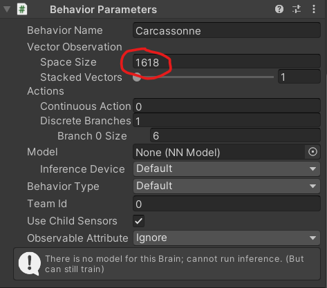

# AI Observation

----------------

Knowing what to observe and how to present the data to the AI can be very tricky. Currently, the AI observes the following:

- Current score
- Current tile ID
- Rotation of the current tile.
- X position of the current tile.
- Z position of the current tile.
- How many tiles have been placed.
- Current game phase.
- Direction of the meeple that is being placed.
- All tiles on the board (contains 1 or 2 observations per possible tile).

The observations for *current game phase* and *meeple direction* are added using the [One-Hot Observation](https://github.com/Unity-Technologies/ml-agents/blob/main/docs/Learning-Environment-Design-Agents.md#one-hot-encoding-categorical-information) style. All other observations are normalized, as is recommended by Unity ML-Agents Toolkit.

## Tile Observations

In order to find out what works best, we provide three different approaches when training the AI. Keep in mind that you can't train an AI with one approach and then run it using another; you must use the same one. If you want to try out the different approaches, you could train a separate AI for each approach. This is selectable through the in-editor inspector window on the CarcassonneAgent script.

**Note:** you must manually change the observation size on the AI prefab. Hover over the selected observation approach in-editor to see the correct size.

*Refer to [BoardObservation.cs](../Assets/Scripts/Carcassonne/AI/BoardObservation.cs) for details on each approach.*
