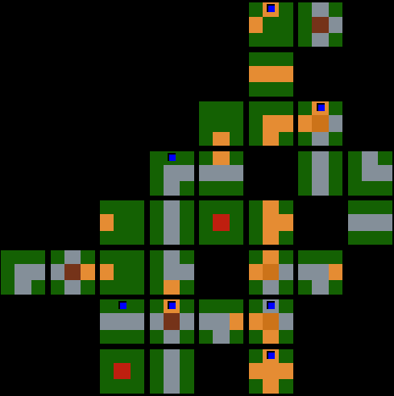

# Board Visualization
---------------------



When creating the training environment, we needed a way to visualize what the AI was doing. This is important for verifying that the AI was doing things correctly. This also resulted in us very easily spotting bugs in the game logic, since the real game hasn't been thoroughly tested.

Our approach was using a custom shader to display every tile and meeple on the board. In order to achieve this, we needed a Unity-compliant shader, and a C# script to manage data flow from the game state to the shader.

-------------------

## The Unity Shader

The [shader](../Assets/Shaders/Visualization.shader) expects two arrays of input from the shader script:
- _TileGeography
- _MeeplePlacement

Shaders have a hard limit of 1023 elements for arrays of floats. This means that the data needs to be space efficient in order to display as many tiles as possible. Basically, every geography of a tile (center, east, north, west, and south) gets packed into a single value. This is sent to the shader as the _TileGeography array. Similarly, at every possible geography, if there is a meeple there, it will have value of the player ID of a meeple's owner, otherwise 0.

#### _TileGeography Format:

Each geography occupies increasing powers of 10.
- Center occupies 1's (1, 2... 9)
- East occupies 10's (10, 20... 90)
- North occupies 100's (100, 200... 900)

**Example**
The shader will interpret the value `32231` as:
- Center = Village
- East = Grass
- North = Road
- West = Road
- South = Grass

#### _MeeplePlacement Format:

A potential meeple at each geography occupies increasing powers of 10.
- Meeple at center occupies 1's (1, 2... 9)
- Meeple at east occupies 10's (10, 20... 90)
- Meeple at north occupies 100's (100, 200... 900)
- Meeple at west occupies 1000's (1000, 2000... 9000)
- Meeple at south occupies 10000's (10000, 20000... 90000)

**Example**
The shader will interpret the value `00200` as:
- Center = no meeple.
- East = no meeple.
- North = a meeple that belongs to player 2.
- West = no meeple.
- South = no meeple.

### Shader Limitations
- Displays no more than *31x31* tiles.
- Player IDs must not be higher than *9*. Valid IDs must be between *1-9*, i.e. ID *1* is Player 1, and an ID of *0* indicates *no ID/player*.
- Similarly, geography values must not be higher than *9*. This means that sending encoded geography values that exceed the integer value *9*, will produce completely erroneous results. The same goes for player IDs.

--------------------

## The Shader Script

In order to send data to the shader, we use Unity's built-in API in C#. The [CarcassonneVisualization.cs](../Assets/Scripts/Carcassonne/Visualization/CarcassonneVisualization.cs) script provides an API allowing us to directly provide objects that are used in the game code without creating special structures just for the visualization.

**Example usage**

```c#
public TileState tileState;
public MeepleState meepleState;
public CarcassonneVisualization visualization;

...

// Always call init before any other method.
visualization.Init(); 

// Visualize the current state of the game.
visualization.VisualizeBoard(tileState.Played, meepleState.All); 

...

```

